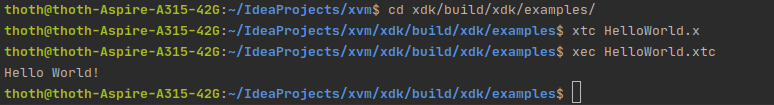

After having wanted to try out ecstasy for over a month, I finally found the time. I Followed the getting started guide 
that can be found in the 
[CONTRIBUTING.md](https://github.com/xtclang/xvm/blob/master/CONTRIBUTING.md#how-to-get-started) 
file in the xvm [GitHub](https://github.com/xtclang/xvm) repository. I had read this guide and several others before 
starting the setup of ecstasy on my machine. Getting and setting up ecstasy did prove to require a little work on my 
part. Though linux is a target platform, it is not fully supported yet. Many of the steps i took are automated on MacOS 
and windows. Having read the readme's about javatools_launcher helped me a great deal in setting up the project on my 
Linux machine. 

After cloning the project I quickly encountered my first hurdle. According to the guide I should move the `Ecstasy.xml` 
file into the `~/Library/Preferences/IntelliJIdea14/filetypes/` directory to enable syntax highlighting. After looking 
for it for 15 minutes I gave up. I decided to instead just add the file association manually through the intellij 
settings. Going to the `File | Settings | Editor | File Types` menu, I was able to set up the highlighting through a 
gui. It required me to copy paste values from `Ecstasy.xml` into the matching gui fields. It was a bit cumbersome but 
as it was a one time thing, I don't mind too much.

Now with syntax highlighting set up, the next step was to compile the project and set up the xdk. The xdk is language 
sdk of ecstasy. According to the guide, one should build the project. I found it to be a bit ambiguous what exactly to 
build. Luckily the project settings that are versioned, set up building the project and running tests. After Building, 
I ran tests as recommended by the guide. The tests failed immediately. After reading through the error message and 
looking through the code I found the cause. Gradle tried to use a file called innerOuter.x, but the actual name of the 
file was innerouter.x. Simple enough to fix.  This time the tests got executed. I got three minor warnings, but that 
weren't going to stop me now. It worked.  
Setting up the xdk would require some work i knew. First the `javatools_launcher` module had to be compiled. For 
windows and macos, a compiled file were already present. By using the `make OS_NAME=linux` command, the launcher 
compiled in no-time.  
The next logical step was to build the xdk. This did however not work. The compiled xdk did not include the linux 
launcher as I had expected. To fix this problem i went through the gradle build file in the xdk module. I reviled the 
problem to be that the build file didn't actually look for that launcher file, only macos and windows. I fixed the 
problem by copying the approach to add launcher files from the macos launcher, making it pertain to linux instead. 
Recompiling the xdk now provided the desired result. I could have stopped here, but there was one last thing I wanted 
to do. I wanted to make a cfg_linux.sh script to do the same job as the equivalent macos script. 
I copied the cfg_macos.sh script and renamed it. From there I simply went through the script replacing "macos" with 
"linux". This simple change was enough to make it work. Using the script, my environment was set up. 

With everything set up and ready there was only one thing left to do. I had to try to compile the provided HelloWorld.x 
ecstasy module. With my hearth in my throat I typed the `xtc HelloWorld.x` command. No error. For executing I typed 
`xec HelloWorld.xtc`. After a few tense seconds the text were finally printed, proving that it worked.
